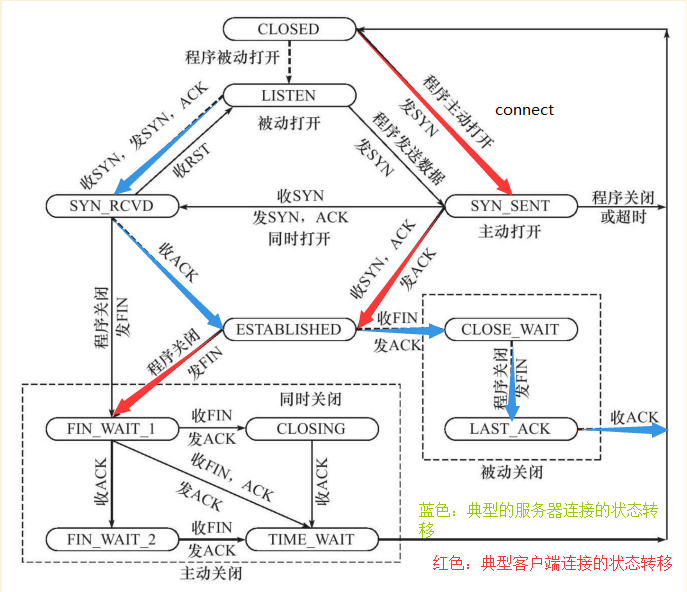

<h1>第一个标题</h1>
<h2>第二个标题</h2>
<h3>第三个标题</h3>
<h4>第四个标题</h4>
<h5>第五个标题</h5>

<a href="https://www.baidu.com">百度链接</a>

<pre>
markdown line
makrdown pre
    ruguo
</pre>

<samp>计算机代码样本 </samp>
<code>计算机输出</code>
<kbd>键盘输入</kbd>
<tt>打字机文本</tt>

My favorite color is <del>blue</del> <ins>red</ins>!
